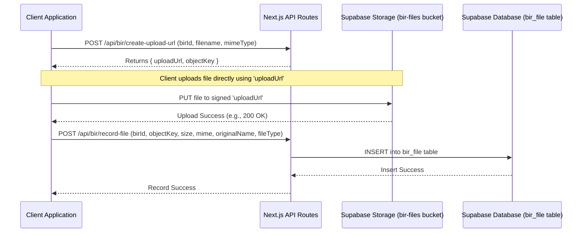

# BIR File Upload Flow (Signed URL)

This document explains the process for uploading Business Information Request (BIR) specific files directly from the client to Supabase Storage using a signed URL. This method enhances security and avoids Vercel's payload limitations for API routes.

## Process Overview

The flow involves three main steps:

1.  **Client Requests Signed URL**: The client application (frontend) makes a request to a dedicated API endpoint to obtain a pre-signed URL for uploading a specific file.
2.  **Direct Client-to-Storage Upload**: The client uses the received signed URL to upload the file directly to the private `bir-files` Supabase Storage bucket.
3.  **Record File Metadata**: After a successful upload to storage, the client makes another API request to record the file's metadata (e.g., name, size, type, storage path) in the `bir_file` database table, linking it to the relevant BIR.

## Mermaid Diagram

## Detailed Steps

1.  **Requesting a Signed URL (`/api/bir/create-upload-url`)**
    *   The client initiates an upload by sending a `POST` request to `/api/bir/create-upload-url`.
    *   The request payload includes:
        *   `birId`: The ID of the Business Information Request this file belongs to.
        *   `filename`: The original name of the file.
        *   `mimeType`: The MIME type of the file.
    *   The API route handler:
        *   Authenticates the user.
        *   Validates the input.
        *   Generates a unique `objectKey` (storage path) for the file, typically incorporating the `birId` and a UUID to ensure uniqueness (e.g., `{bir_id}/{uuid}.{ext}`).
        *   Uses the Supabase Admin client to create a signed upload URL for the `bir-files` bucket and the generated `objectKey`.
        *   Returns the `uploadUrl` and `objectKey` to the client.

2.  **Direct File Upload to Supabase Storage**
    *   The client receives the `uploadUrl` and `objectKey`.
    *   It then performs a `PUT` request directly to the `uploadUrl`, with the file content as the request body and appropriate headers (e.g., `Content-Type: mimeType`).
    *   Supabase Storage handles the authorization based on the signed URL's parameters and stores the file.

3.  **Recording File Metadata (`/api/bir/record-file`)**
    *   Upon successful upload to storage, the client sends a `POST` request to `/api/bir/record-file`.
    *   The request payload includes:
        *   `birId`: The ID of the Business Information Request.
        *   `objectKey`: The storage path where the file was uploaded (received from step 1).
        *   `size`: The size of the file in bytes.
        *   `mimeType`: The MIME type of the file.
        *   `originalName`: The original name of the file.
        *   `fileType`: A specific category for the BIR file (e.g., 'Logo', 'StyleGuide', as defined in `BirFileType`).
    *   The API route handler:
        *   Authenticates the user.
        *   Validates the input.
        *   Inserts a new record into the `bir_file` table with the provided metadata, linking it to the `business_information_requests` table via `bir_id`.

This flow ensures that file uploads are secure, efficient, and managed correctly within the application's data model. 

---

## Common Issues & Resolutions

### "403 Forbidden" Error When Saving BIR Text Data

While this document focuses on file uploads, a critical issue related to the main BIR form is documented here for completeness.

- **Symptom**: Users would receive a "403 Forbidden" error when trying to save a draft of the BIR text-based form, particularly for a new project where no BIR existed yet. This error originates from the `POST` or `PATCH` request to the `/api/bir` endpoint, not the file upload endpoints.
- **Root Cause**: A race condition was identified in the main form component, `src/features/bir/MultiStepBirForm.tsx`. The form's save action could be triggered by the user before the application had finished loading the authenticated user's session data via the `useAuth()` hook.
- **Mechanism of Failure**: This resulted in an API call to `/api/bir` with an empty or `undefined` `client_id`. The Supabase Row Level Security (RLS) policy on the `business_information_requests` table correctly rejected this invalid request, as it requires a valid `client_id` that matches the authenticated user.
- **Resolution**: The fix was implemented in the `MultiStepBirForm.tsx` component. A new loading state (`isFormLoading`) was introduced, which tracks the loading state of both the BIR data and the user's auth session. All form action buttons are now disabled while `isFormLoading` is true. This prevents the user from submitting the form until all necessary data is available, resolving the race condition and ensuring a valid `client_id` is always included in the request. 